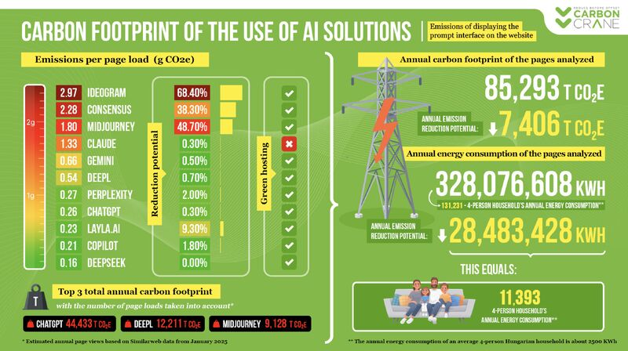

# AI로 데이터 분석하기

**저자**: [Gábor Békés](https://sites.google.com/site/bekesg/), 중앙 유럽 대학교 (오스트리아, EU)

**버전**: v.0.4. 2025-04-04

## 소개

이 과정은 이미 핵심 데이터 분석 방법에 익숙한 학생들에게 AI 기술을 활용하여 생산성을 향상시키는 경험을 제공할 것입니다 (*네, 이것은 고전적인 LLM 문장입니다*). 하지만 예, 아이디어는 데이터 분석 / 계량 경제학 / 정량적 방법을 공부한 학생들이 **분석 루틴에 AI를 포함하는 방법**에 대해 생각하고 경험을 공유하는 데 시간을 할애하도록 돕는 것입니다.

AI가 점점 더 강력해짐에 따라 **데이터 분석에서 인간의 주체성에 대해 논의**할 수 있는 플랫폼을 제공하는 것도 중요합니다. 따라서 과정과 강사의 핵심 요소는 데이터 분석의 다양한 측면에서 AI와 인간의 역할에 대한 토론을 이끄는 것입니다.

## 과정 설명

### 내용

이 과정은 OpenAI의 ChatGPT, Anthropic Claude.ai, Mistral의 Le Chat, Google의 Gemini와 같은 대규모 언어 모델(LLM)을 사용하여 **데이터 분석 작업을 수행**하는 데 중점을 둡니다. 데이터 추출 및 정리, 데이터 탐색 및 기술 통계, 보고서 작성, 텍스트를 데이터로 변환하는 등의 주제를 다룹니다.

우리가 사용하는 세 가지 **사례 연구**가 있습니다. (1) 오스트리아 호텔에 대한 시뮬레이션된 데이터 테이블 세트, (2) 세계 가치 조사, (3) 일련의 인터뷰 텍스트.

과정 자료에는 주간 실습 **과제**가 포함됩니다.

### 배경 지식

**데이터 분석 / 계량 경제학**에 대한 배경 지식이 필요하며, 좋은 입문 과정으로 충분합니다. 물론 저는 [비즈니스, 경제 및 정책을 위한 데이터 분석 (Cambridge UP, 2021)](https://gabors-data-analysis.com/getting-started)의 1-12장과 19장을 제안합니다. 전체 슬라이드쇼, 데이터 및 코드는 오픈 소스입니다. 하지만 책을 구입하는 것을 고려해 보세요.
특히 이 과정은 [데이터 분석의 1-6장과 7-10장, 19장](https://gabors-data-analysis.com/chapter-details/)을 기반으로 하지만 다른 입문 계량 경제학 + 데이터 과학 기본 지식도 괜찮습니다.

학생들은 Python 또는 R (Stata도 대부분 괜찮음)에 대한 기본적인 **코딩 지식**을 갖추고 있어야 합니다.

### 관련성

AI는 어디에나 있으며 필수가 되었으며 대부분의 분석 작업에서 사용될 것입니다.

### 학습 결과

주요 결과. 과정이 끝나면 학생들은 다음을 수행할 수 있게 됩니다.

* genAI를 사용하여 데이터 분석의 주요 작업을 수행하는 경험과 자신감을 얻습니다.
* 데이터 정리, 설명 및 보고, 텍스트 분석을 포함한 코딩 실습에 AI를 구축합니다.
* AI 지원이 (1) 매우 유용하거나, (2) 도움이 되거나, (3) 현재 문제가 있는 경우의 사용 사례에 대한 아이디어를 갖습니다.
* AI 지원을 그대로 사용해도 되는 경우와 강력한 인간 감독이 필요한 경우의 사용 사례에 대한 아이디어를 갖습니다.
* 업데이트를 위한 리소스에 대한 이해를 갖습니다.

### 대상 독자

이것은 필수 배경 지식을 갖춘 모든 프로그램의 3학년 (2학년?) 학사 및 (A 학생)을 대상으로 하는 과정입니다.

하지만 적절한 배경 지식이 있는 사람이라면 누구나 사용할 수 있습니다.

### 과제

모든 수업에 대한 과제가 제공됩니다.

**과제에 대한 중요 참고 사항: **
* AI를 사용하되 AI가 만든 것을 제출하지 마십시오. AI는 여러분의 조수입니다.
* 이 과정의 목표 중 하나는 이것을 연습하는 것입니다.

## 1주차: LLM 검토

LLM이란 무엇이며 마법은 어떻게 일어나는가. 비기술적인 간략한 소개. LLM으로 작업하는 방법은? 응용 프로그램에 대한 아이디어도 포함합니다. 제안된 읽을거리, 팟캐스트 및 시청할 비디오가 포함됩니다.

[내용](/week01)

**어떤 AI?** [현재 모델에 대한 내 의견](week01/assets/which-ai.md)을 참조하십시오. *2025년 5월* 기준.

## 2주차: AI를 사용한 데이터 및 코드 검색 및 문서화

명확하고 전문적인 코드 및 데이터 문서를 작성하는 방법을 배웁니다. 기본 사항을 알고 나면 LLM이 큰 도움이 됩니다.

사례 연구: 세계 가치 조사. 데이터는 [WVS](/data/VWS)에 있습니다.

[내용](/week02)

## 3주차: 보고서 작성

데이터와 작업이 주어지면 짧은 보고서를 작성해야 합니다. 원샷 프롬프트에서 반복에 이르기까지 LLM을 사용한 다양한 옵션을 비교합니다.

사례 연구: 세계 가치 조사. 데이터는 [WVS](/data/VWS)에 있습니다.

[내용](/week03)

## 4주차: 데이터 정리, 테이블 결합

내 교과서에 무엇을 추가해야 하는지 물었을 때 노벨상 수상 경험 경제학자인 데이비드 카드는 테이블 결합에 시간을 할애해야 한다고 말했습니다. 자, 갑시다.

사례 연구: 시뮬레이션된 오스트리아 호텔. 데이터는 [hotels](/data/austria-hotels)에 있습니다.

[내용](/week04)

## 5주차: 데이터로서의 텍스트 1 -- 소개 강의

내 어떤 과정도 축구(soccer)를 피할 수 없습니다. 여기서는 경기 후 인터뷰를 살펴보고 텍스트 분석의 기본을 배우고 LLM을 가장 잘하는 분야인 문맥 의존적 학습에 적용합니다. 두 차례의 수업 시리즈입니다. 첫 번째는 자연어 처리에 대한 소개입니다.

사례 연구: 축구 경기 후 인터뷰. 데이터는 [interviews](/data/interviews)에 있습니다.

[내용](/week05)

## 6주차: 데이터로서의 텍스트 2 -- 실습

두 번째 수업, 이제 실전입니다. LLM은 인간과 어떻게 비교될까요?

사례 연구: 축구 경기 후 인터뷰. 데이터는 [interviews](/data/interviews)에 있습니다.

[내용](/week06)

## 더 알아보기

[learn-more](/learn-more) 폴더에 자료를 추가하고 있습니다. [beyond](/learn-more/beyond.md) 페이지부터 시작할 수 있습니다.

---

## 권리 및 고지

## 자유롭게 가르치고 배울 수 있습니다.

**저작자 표시**: Békés, Gábor: "Doing Data Analysis with AI: a short course", [github.com/gabors-data-analysis/da-w-ai/](https://github.com/gabors-data-analysis/da-w-ai/)에서 사용 가능, v0.5, 2025-05-14

**라이선스**: [CC BY-NC-SA 4.0](https://creativecommons.org/licenses/by-nc-sa/4.0/) -- 공유, 저작자 표시, 비상업적 (기업 공연 문의는 저에게 연락하십시오)

## 감사

**감사**: 대부분 [저, Gábor Békés](https://bsky.app/profile/gaborbekes.bsky.social)가 개발했습니다. 두 분의 훌륭한 인간 RA인 [Zsuzsa Vadle 씨](https://bsky.app/profile/zsuzsannavadle.bsky.social)와 [Kenneth Colombe 씨](https://bsky.app/profile/kcolombe24.bsky.social)께 백만 번 감사드립니다. 두 분 모두 박사 과정 학생입니다. 시뮬레이션된 데이터 세트를 만드는 데 큰 도움을 준 Claude.ai에 감사드립니다. ChatGPT와 Claude.ai는 슬라이드쇼를 만드는 데 도움을 주었고 NLP에 대해 *저*를 교육했습니다.

인간과 AI에게 비용을 지불할 수 있게 해준 CEU의 강의 보조금에 감사드립니다.

## 질문 및 제안

이 자료는 오스트리아 비엔나에 있는 CEU에서의 제 과정을 기반으로 합니다. 이 Github 저장소에서 강의합니다.

질문이나 제안이 있거나 더 자세히 알고 싶다면 [이 양식을 작성하십시오](https://docs.google.com/forms/d/e/1FAIpQLSev0oaR2s71hvFTZjhTwCuCPL00ljYWAIjl0hoZQLTn_oG3KQ/viewform?usp=header).

## 그리고 이제 이것입니다.

AI 사용은 에너지 측면에서 매우 비용이 많이 듭니다. 예, 저렴해지고 있습니다. 하지만 인류는 또한 그것을 *훨씬* 더 많이 사용하고 있습니다.

