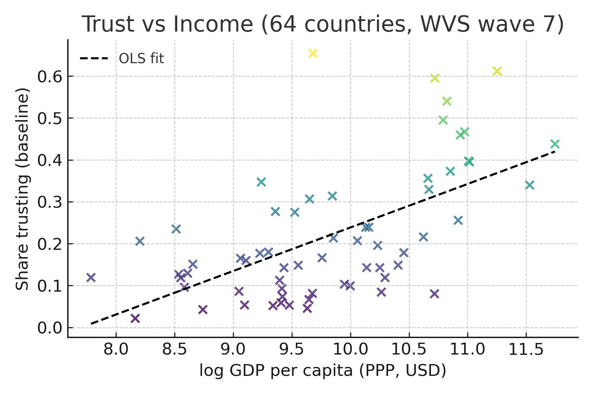

# Income and Trust

*World Values Survey Wave 7; N = 64 countries*  

## Introduction

We examine whether national income levels are associated with interpersonal
trust. Trust is central to economic performance and social cohesion, and
understanding its determinants can inform development policy.

## Data & Measures

- **Income:** GDP per capita, PPP (constant USD, log‑scaled).

- **Baseline trust:** share answering “Most people can be trusted” (Q57).

- **Alternative trust index:** reverse‑coded average of trust in neighbours, people known personally, first‑time met, other religion, other nationality (Q59–Q63).

## Descriptive Pattern

## Regression Results

### Baseline trust

β₁ = 0.104  (SE 0.018, p = 0.000)

### Alternative trust

β₁ = 0.137  (SE 0.030, p = 0.000)

## Discussion

The positive coefficient indicates that richer countries tend to report higher
levels of interpersonal trust. A one‑log (≈ 2.7×) increase in GDP per capita is
associated with an average increase of 0.104 points in the baseline trust
measure (on a 0‑1 scale). Results hold for the broader five‑item trust index.

## Conclusion

Higher income levels correlate with greater trust. While causality cannot be established here, the pattern supports theories linking economic prosperity to social capital.
